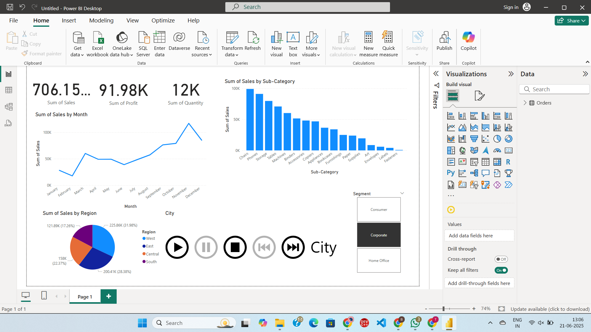

# 🛒 Superstore Sales Dashboard (Power BI)

This project visualizes Superstore sales data using **Microsoft Power BI**.

## 📁 Files Included
- `Superstore Dashboard.pbit`: Power BI Template
- `superstore.csv`: Dataset
- `dashboard-preview.png`: Screenshot (optional)

## 📊 Features
- Sales, Profit, and Discount analysis
- Category and Region performance
- Customer segmentation
- Time-based trends

## 🧠 Tools Used
- Power BI
- DAX
- Power Query

## 🖥️ Preview

